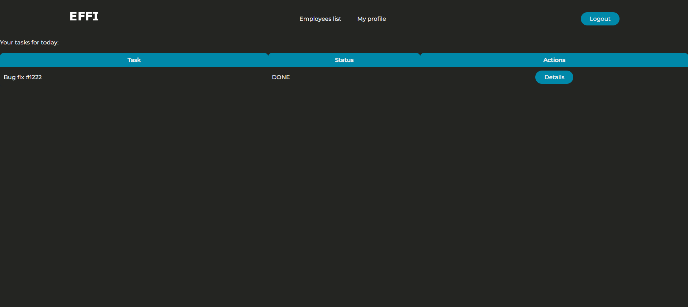
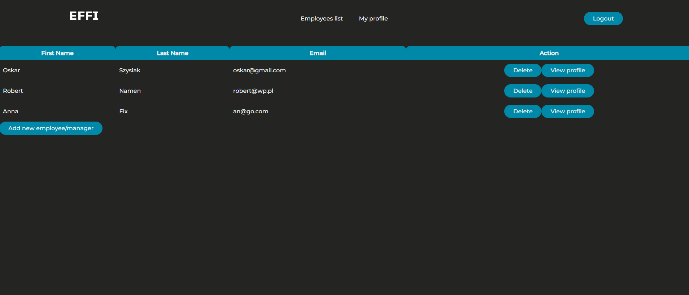
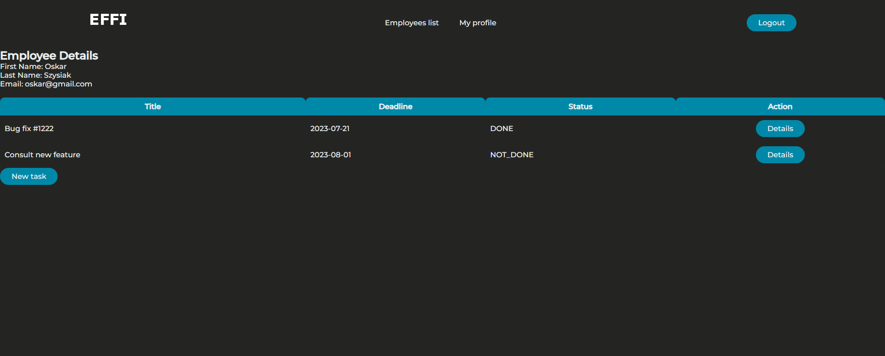
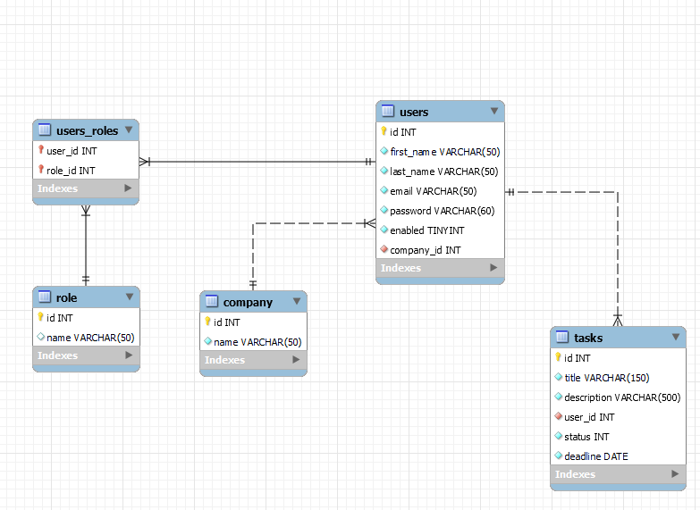

# EffiApp
## description
EffiApp is a project with which I wanted to practise and polish my knowledge of Java, the Spring framework and Hibernate. User data is stored in a MySQL database, the schema of which can be seen below. The application was built using the Spring framework and secured using Spring Security. Users can have 3 roles: ADMIN - who can add and remove users and is the owner of the company that uses the application and has the capabilities of the other roles, MANAGER - who has the ability to add tasks to be performed by employees and has the capabilities made available to regular employees and EMPLOYEE, who can only display his profile and edit the deadline and status of his tasks. I used the Hibernate framework to communicate with the database. In the future, I plan to practice test development on this project.
## sample views of the program

